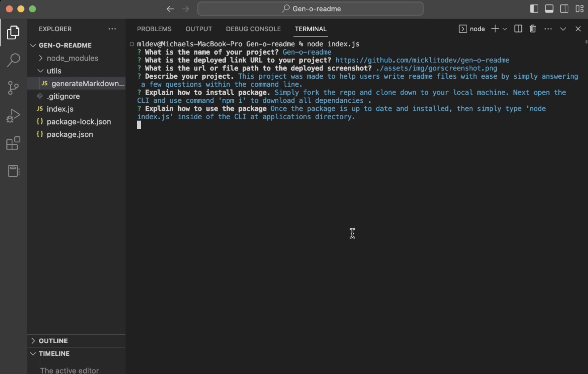

  # Gen-o-readme

  ## Description
  
  This project simplifies the process of creating a read me by just answering a few questions inside of the CLI. 

  ## Table of contents
  
  - [ Link ](#link)
  - [ Screenshot ](#screenshot)
  - [ Installation ](#installation)
  - [ Usage ](#usage)
  - [ Contributions ](#contributions)
  - [ Tests ](#tests)
  - [ Questions ](#questions)
  - [ License ](#license)
  

  ## Link
  
  [Click Here](https://drive.google.com/file/d/1h5n7GU7seT495lMZ2JINEF0kAUTQjASG/view) to go to the video link.

  [Click Here](https://github.com/micklitodev/gen-o-readme) to go to the repo link.
  

  ## Screenshot
  
  
  

  
  ## Installation
  
  simply fork the repo and then clone down to your local machine. Next run 'npm i ' to ensure all dependacies for the repo have been correctly installed

  
  ## Usage
  
  Open the CLI at specified directory and use comman ' node index.js ' 
  
  
  ## Contributions
  
  How to contribute?: 
  To contibute to the read me just create a pull request however, please know that all pull request will be ignored if they do not meet these requirements. Code must be clear and legiable, all variables must contain proper naming conventions and code must use best practices. also the pull request must include a detailed reason why this change was deemed necissary and comments describing each function and intention of each code segment. 
  

  
  ## Tests
  
  To test this application run threw the user input prompts, then compare user input to data generated in the README.md. 
  

  
  ## Questions
  
  Github - Mick L. - https://github.com/micklitodev

  Email - micklito.dev@gmail.com

  When contact me please be mindful of timezones, Please check my profile for my
  current time information. Also, if it pertains to a bug, Please, use a clear,
  legible, instructions on how to recreate this bug as well as any videos or 
  screenshots will be appriciated. Please also make the subject the specified project
  name with a short description of what the contact pertains to. Thank you! 

  
  ## License
  
  ASF  

   To see full details visit undefined

   Preview... 

   1. Definitions.

      "License" shall mean the terms and conditions for use, reproduction, and distribution as defined by Sections 1 through 9 of this document.
      
      "Licensor" shall mean the copyright owner or entity authorized by the copyright owner that is granting the License.
      
      "Legal Entity" shall mean the union of the acting entity and all other entities that control, are controlled by, or are under common control with that entity. For the purposes of this definition, "control" means (i) the power, direct or indirect, to cause the direction or management of such entity, whether by contract or otherwise, or (ii) ownership of fifty percent (50%) or more of the outstanding shares, or (iii) beneficial ownership of such entity.
      
      "You" (or "Your") shall mean an individual or Legal Entity exercising permissions granted by this License.
      
      "Source" form shall mean the preferred form for making modifications, including but not limited to software source code, documentation source, and configuration files.
      
      "Object" form shall mean any form resulting from mechanical transformation or translation of a Source form, including but not limited to compiled object code, generated documentation, and conversions to other media types.
      
      "Work" shall mean the work of authorship, whether in Source or Object form, made available under the License, as indicated by a copyright notice that is included in or attached to the work (an example is provided in the Appendix below).
      
      "Derivative Works" shall mean any work, whether in Source or Object form, that is based on (or derived from) the Work and for which the editorial revisions, annotations, elaborations, or other modifications represent, as a whole, an original work of authorship. For the purposes of this License, Derivative Works shall not include works that remain separable from, or merely link (or bind by name) to the interfaces of, the Work and Derivative Works thereof.
      
      "Contribution" shall mean any work of authorship, including the original version of the Work and any modifications or additions to that Work or Derivative Works thereof, that is intentionally submitted to Licensor for inclusion in the Work by the copyright owner or by an individual or Legal Entity authorized to submit on behalf of the copyright owner. For the purposes of this definition, "submitted" means any form of electronic, verbal, or written communication sent to the Licensor or its representatives, including but not limited to communication on electronic mailing lists, source code control systems, and issue tracking systems that are managed by, or on behalf of, the Licensor for the purpose of discussing and improving the Work, but excluding communication that is conspicuously marked or otherwise designated in writing by the copyright owner as "Not a Contribution."
      
      "Contributor" shall mean Licensor and any individual or Legal Entity on behalf of whom a Contribution has been received by Licensor and subsequently incorporated within the Work.
  
  
  
  